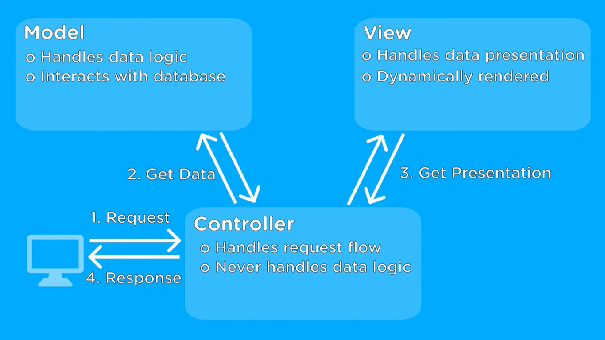

# Flight Delay Prediction and Live Monitoring App✈️📊

## Table of Contents
- [Introduction](#introduction)
- [Project Overview](#project-overview)
- [Requirements](#requirements)
- [Getting Started](#getting-started)
- [Data Preprocessing](#data-preprocessing)
- [Model Building and Evaluation](#model-building-and-evaluation)
- [Docker Configuration 🐳](#docker-configuration)
- [MVC Architecture 🏗️](#mvc-architecture)
- [Using the App](#using-the-app)
- [Contributing](#contributing)
- [License](#license)

## Introduction 🚀

This project aims to predict flight delays using machine learning and monitor the data and model in the production environment. Flight delays are a common concern for both travelers and airlines. By predicting these delays, airlines can better manage their schedules, and passengers can make informed decisions.

In this README, we will provide a comprehensive guide to understand, replicate, and contribute to this project.

## Project Overview 📈

Our project consists of several components:

### Data Collection 📦
We use historical flight data, specifically the "DelayedFlights" dataset, which contains a wealth of information about flights in the United States.

### Data Preprocessing 🧹
Raw data needs to be cleaned, and features should be transformed into a format suitable for machine learning. We also handle missing data and encode categorical variables.

### Model Building and Evaluation 🧪
We experiment with different machine learning models like Linear Regression, Random Forest Classifier, xgboost, lightgbm, ridge regression and evaluate their performance using metrics like Mean Absolute Error (MAE) and Mean Squared Error (MSE). The best-performing model will be deployed in the application.

### Deployment 🚀
We create a user-friendly web application using Streamlit. Users can input flight details, and the model predicts the expected delay. This application helps passengers make informed choices.

## Requirements 📋

Before starting, ensure you have the following prerequisites:

- Python 3.7+
- Required Python packages: Pandas, Scikit-Learn, Joblib, Streamlit
- The "DelayedFlights" dataset, available [https://www.kaggle.com/datasets/giovamata/airlinedelaycauses]

## Getting Started 🚀

1. Clone this repository to your local machine.

    ```bash
    git clone https://github.com/yourusername/flight-delay-prediction.git
    cd flight-delay-prediction
    ```

2. Install the necessary Python packages.

    ```bash
    pip install -r requirements.txt
    ```

## Data Preprocessing 🧹

In the data preprocessing step, we clean and transform the dataset for use in machine learning. We also perform feature scaling and one-hot encoding for categorical variables.

To replicate this step, refer to the `data_preprocessing.py` script.

```bash
python data_preprocessing.py
```

## Model Building and Evaluation 🧪
We experiment with different machine learning models and evaluate their performance using metrics. The best model is then deployed.

To replicate this step, refer to the model_evaluation.py script.

```bash
python model_evaluation.py
```

### Docker Configuration 🐳

Docker is an essential tool for packaging and distributing applications. Here's how to set up and use Docker for this project:

1. **Dockerfile:** The Dockerfile in your project directory contains the instructions for building a Docker image. Ensure that you have the correct syntax and structure in place.

2. **Running the Docker Container:** Follow these steps to build the Docker image and run a container:

    ```bash
    docker build -t flight-delay-prediction .
    docker run -p 8501:8501 flight-delay-prediction
    ```

3. **Best Practices:** Consider best practices such as data volume management, security, and image optimization.

### MVC Architecture 🏗️

The Model-View-Controller (MVC) architecture is a design pattern used in this project:

1. **Model:** The Model component represents the core logic of your application. It handles data, processing, and machine learning model interactions. The Model script is located in the `src/model/` directory.

2. **View:** The View component is responsible for the user interface. It interacts with the user and displays information. The View script is in the `src/view/` directory.

3. **Controller:** The Controller component acts as an intermediary between the Model and View. It handles user input and requests. The Controller script is located in the `src/controller/` directory.

4. **MVC Diagram:** Below is a visual representation of the MVC architecture:

   

5. **Reference Video:** To learn more about the MVC architecture, check out this [video](https://youtu.be/DUg2SWWK18I?si=QpfXID7by1IgiOPe).


## Using the App 📱
The heart of our project is the Streamlit web application. It provides an interface for users to input flight details and get predictions.

To install Streamlit application, execute the following:

```bash
pip install streamlit
```

To run the application, execute the following:

```bash
streamlit run app.py
```

Visit http://localhost:8501 in your web browser to use the app.

## Make Predictions

In this section in Streamlit, you can make flight delay predictions with ease. Just select the input values and let the app do the rest.


## Monitor Data and Model

This is where the magic happens! You can monitor various aspects of your data and model. Choose a date range and select the reports you'd like to generate:

- **Start Month**: Select the starting month for monitoring.
- **End Month**: Choose the ending month.
- **Start Day**: Specify the starting day.
- **End Day**: Set the ending day.

### Select Reports to Generate

Choose the types of reports you want to generate:

- ✅ **Model Performance Report**
- ✅ **Target Drift Report**
- ✅ **Data Drift Report**
- ✅ **Data Quality Report**

Once you hit the "Submit" button, the app will fetch your current data and generate these insightful reports for you.


## Generating Reports

The app will generate various reports based on your selections:

- **Model Performance Report**: Get insights into your model's performance.
- **Target Drift Report**: Identify any drift in your target variable.
- **Data Drift Report**: Discover any changes in your data distribution.
- **Data Quality Report**: This one takes a bit longer (around 10 minutes) because it performs a comprehensive analysis. You can explore other reports if you're short on time.


That's it! Start making predictions and monitor your data and model like a pro. Happy flying! ✈️📊🚀

## Contributing 🤝
We welcome contributions! If you want to improve the project, feel free to create a pull request or open an issue. Please follow our Contribution Guidelines.

## License 📜
This project is open-source and is licensed under the [MIT License](LICENSE.md). You can find the full text of the license in the [LICENSE.md](LICENSE.md) file. 🚀

Feel free to use, modify, and distribute this project as you see fit while retaining proper attribution. 📊

This open-source project is shared with the hope that it contributes to the data science and machine learning community. Happy coding! 🤝
